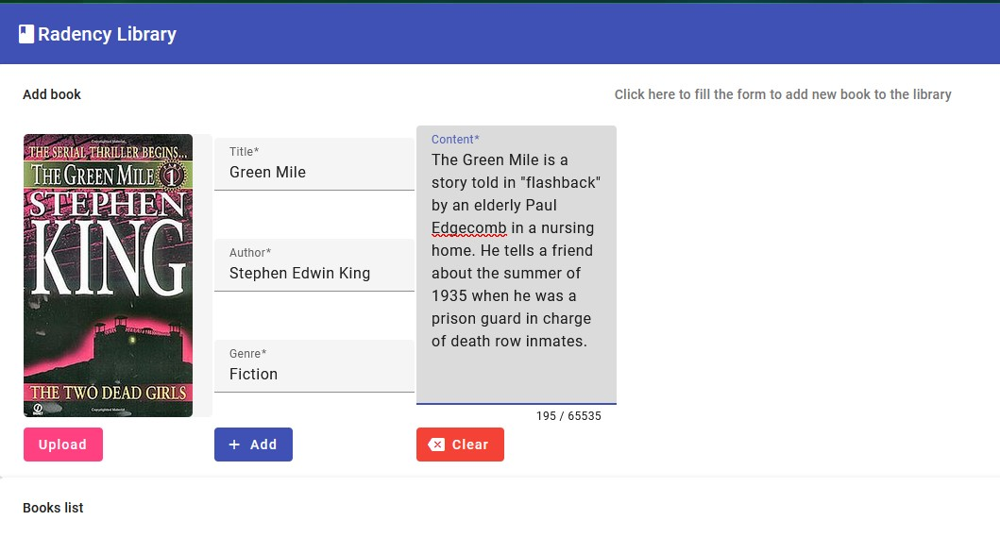
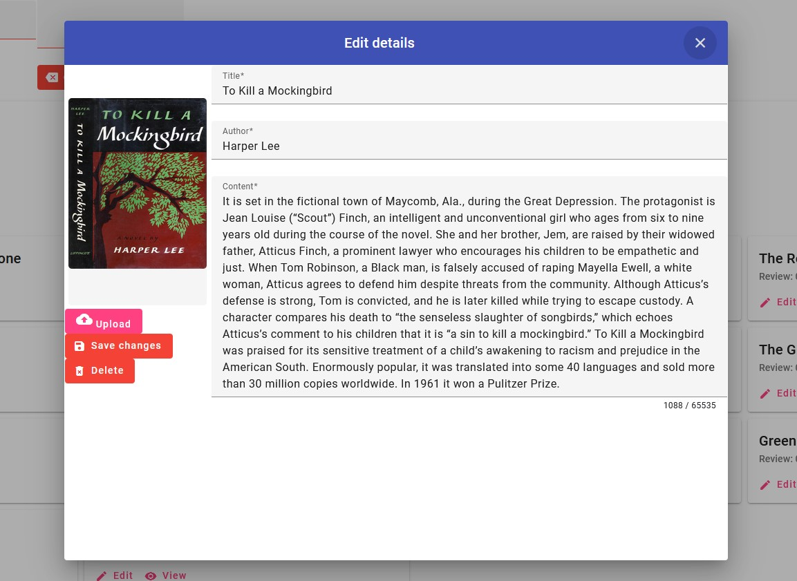
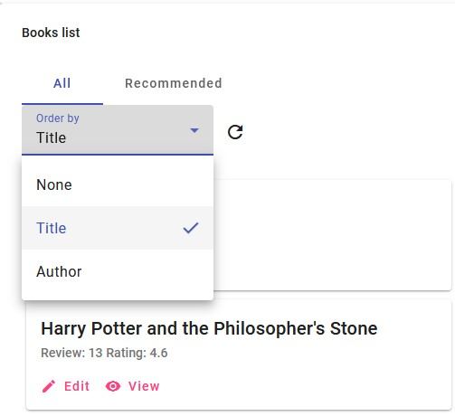
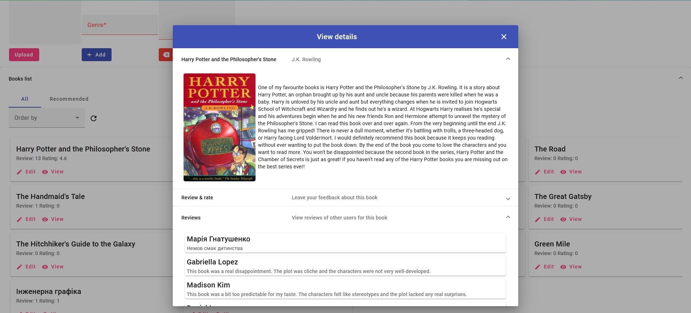

# RadencyLibraryFrontend
> Angular Material frontend for [backend on ASP.NET (Web API)](https://github.com/rudyson/RadencyLibraryWebAPI)

### 1. Run backend service
```
dotnet run
```

### 2. Run frontend using
```
ng serve
```

### 3. Open website
[http://localhost:4200/](http://localhost:4200/)

## Showcase
### Adding new book


### Editing details


### Ordering book list


### View book information
> You can see reviews of other users or leave yours review. Also you can leave score of book (from 1 to 5). Stay polite to other users!

